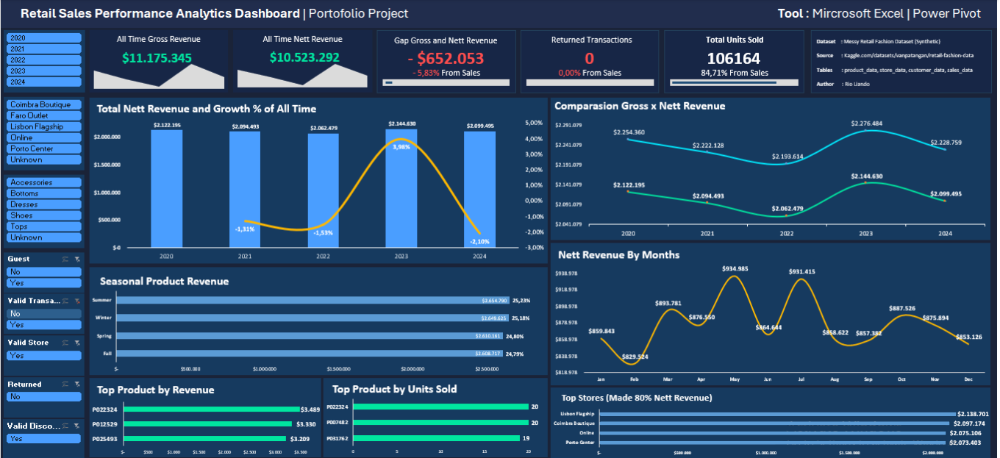

## 🇬🇧 EN

### 1. Default View: Raw Data Overview

Initially, the dashboard displays the complete dataset, including raw inputs that require validation.

> **Observation:**
> * **Data Quality:** Approximately **7,630 invalid transactions** were identified. To ensure analytical reliability, we apply the **"Transaction Valid Only"** slicer to filter out these anomalies.
> 
> 

---

### 2. Filtered View: Valid Transactions

By toggling the slicer to `Valid Only`, the dashboard removes noise and reveals the true business performance.

> **Key Business Insights:**
> * **Revenue Gap (Gross vs Net):** A gap of **~15%** exists, with **Returns (9.92%)** contributing to **⅔** of this gap—signaling a need to improve product quality.
> * **Growth Stability:** Year-over-year growth is volatile, peaking at only **±4%**, indicating the need for a sustainable growth strategy.
> * **Seasonality:** Sales consistently peak in **Q2–Q3 (May–Jul)**, while Q1 and Q4 remain weak.
> * **Pareto Principle:** A small subset of products/stores drives **80%** of net revenue, validating a focused resource strategy.

## 🇮🇩 ID

### 1. Tampilan Default: Tinjauan Data Mentah

Pada awalnya, dasbor menampilkan kumpulan data (*dataset*) lengkap, termasuk input mentah yang memerlukan validasi.

> **Observasi:**
> * **Kualitas Data:** Sekitar **7.630 transaksi tidak valid** telah teridentifikasi. Untuk memastikan reliabilitas analisis, kami menerapkan *slicer* (pemotong data) **"Transaction Valid Only"** untuk menyaring anomali tersebut.
> 
> 

---

### 2. Tampilan Terfilter: Transaksi Valid

Dengan mengaktifkan *slicer* ke posisi `Valid Only`, dasbor akan menghilangkan *noise* (gangguan data) dan mengungkapkan performa bisnis yang sebenarnya.

> **Wawasan Bisnis Utama (*Key Business Insights*):**
> * **Celah Pendapatan (Kotor vs Bersih):** Terdapat celah sekitar **~15%**, di mana **Retur (9,92%)** berkontribusi terhadap **⅔** dari celah ini—hal ini menandakan adanya kebutuhan mendesak untuk meningkatkan kualitas produk.
> * **Stabilitas Pertumbuhan:** Pertumbuhan tahun-ke-tahun (*Year-over-Year*) cenderung fluktuatif dan hanya memuncak pada angka **±4%**, yang mengindikasikan perlunya strategi pertumbuhan yang lebih berkelanjutan.
> * **Musiman (*Seasonality*):** Penjualan secara konsisten memuncak pada **Q2–Q3 (Mei–Jul)**, sementara Q1 dan Q4 cenderung lemah.
> * **Prinsip Pareto:** Sebagian kecil dari produk/toko menyumbang **80%** dari pendapatan bersih (*net revenue*), yang memvalidasi perlunya strategi sumber daya yang terfokus.
> 
> 
